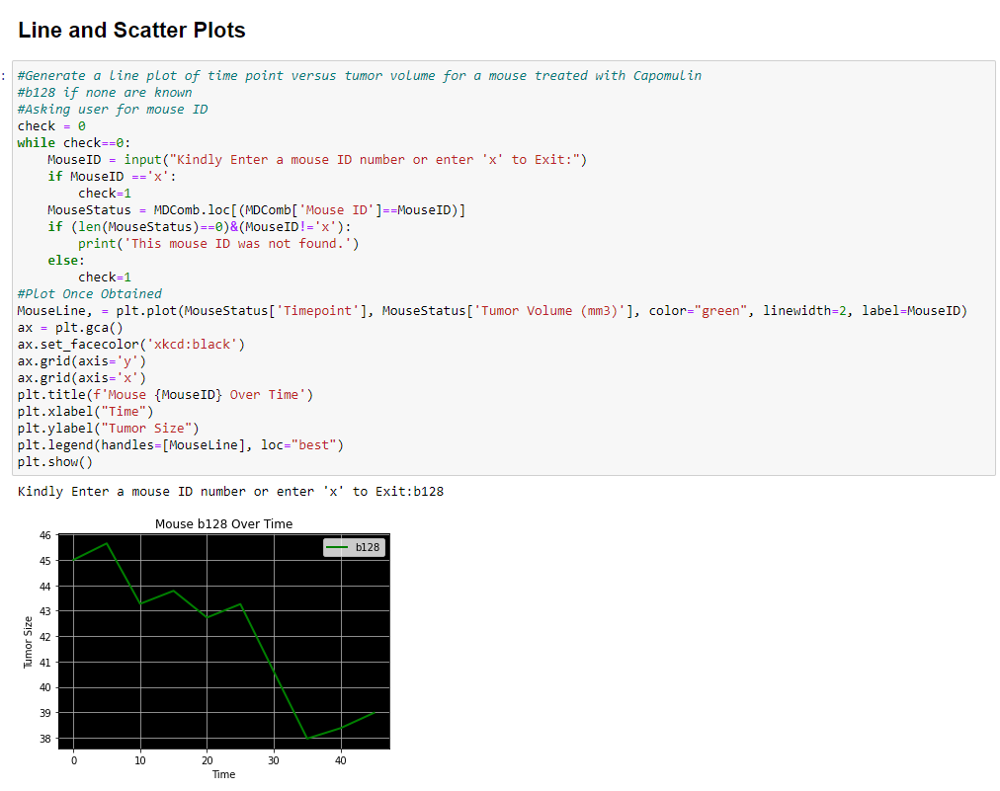

# Mice-Timepoint-Data-Analysis
Analysis of Timepoint Data of mice throughout studies.

### Instructions
Ensure you have the modules used in the ipynb files installed in your environment. Run pymaceuticals_starter.ipynb in jupyter notebooks.

## Visuals:

